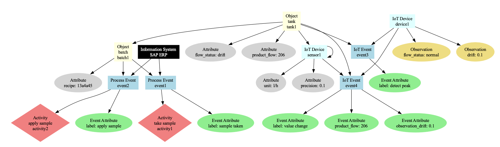

# Common-Core Model

## Overview
The Common-Core Model (CCM) is a framework for managing and representing data related to events, objects, activities, and data sources in a structured format. It includes various classes to represent these entities and their relationships.

## Classes

| Class         | Description                                                                                      | Relationships                                                                                                       |
|---------------|--------------------------------------------------------------------------------------------------|--------------------------------------------------------------------------------------------------------------------|
| `Attribute`   | Represents an attribute of an object or event.                                                   | Used in `Object`, `Event`, and its subclasses.                                                                     |
| `Event`       | Represents a general event with an ID, type, attributes, timestamp, data source, and related objects. | Can be associated with `DataSource` and `Object`.                                                                  |
| `IoTEvent`    | Inherits from `Event` to represent an IoT-specific event.                                        | Subclass of `Event`.                                                                                               |
| `Activity`    | Represents an activity associated with a process event.                                          | Used in `ProcessEvent`.                                                                                            |
| `ProcessEvent`| Inherits from `Event` to represent a process-specific event.                                      | Subclass of `Event`, contains `Activity`.                                                                          |
| `DataSource`  | Represents a data source with an ID, type, and associated events.                                 | Can be linked to `Event` and `Object`.                                                                              |
| `IS`          | Inherits from `DataSource` to represent an information system.                                    | Subclass of `DataSource`.                                                                                           |
| `SOSA`        | Namespace for the SOSA ontology, including `Observation` and `IoTDevice` classes.                 | `SOSA.IoTDevice` is a subclass of `DataSource`, contains `SOSA.Observation`.                                        |
| `Object`      | Represents an object with an ID, type, attributes, related objects, events, and data sources.     | Can be linked to `Event`, `DataSource`, and other `Object` instances.                                               |
| `CCM`         | Represents the overall dataset containing events, objects, data sources, information systems, IoT devices, and activities. | Aggregates all other classes, manages their relationships, provides methods for data manipulation and visualization. |

## Class Relationships

- **Attribute**
  - Used by `Event`, `ProcessEvent`, `IoTEvent`, `Object`, and `DataSource`.

- **Event**
  - General class for events.
  - Contains attributes (`Attribute`).
  - Can have a `DataSource`.
  - Can be linked to multiple `Object`.

- **IoTEvent**
  - Inherits from `Event`.

- **ProcessEvent**
  - Inherits from `Event`.
  - Contains activities (`Activity`).

- **Activity**
  - Used in `ProcessEvent`.

- **DataSource**
  - Contains events (`Event`).
  - Subclassed by `IS` and `SOSA.IoTDevice`.

- **IS**
  - Inherits from `DataSource`.

- **SOSA**
  - Contains `Observation` and `IoTDevice`.

  - **SOSA.Observation**
    - Used by `SOSA.IoTDevice`.

  - **SOSA.IoTDevice**
    - Inherits from `DataSource`.
    - Contains `SOSA.Observation`.
  - **TODO**: Add `SOSA.Sensor` and `SOSA.Actuator`...

- **Object**
  - Contains attributes (`Attribute`).
  - Can be linked to `Event` and `DataSource`.
  - Can be linked to other `Object` instances.

- **CCM**
  - Aggregates all other classes.
  - Manages the relationships between events, objects, data sources, information systems, IoT devices, and activities.
  - Provides methods for data manipulation (`add_event`, `add_object`, etc.).
  - Provides methods for data visualization and exporting (`visualize`, `save_to_json`).

## Usage Example



```python
# Initialize CCM instance
ccm = CCM()

# Create objects
object_batch = Object(object_id="batch1", object_type="batch", attributes=[
    Attribute(key="recipe", value="13a4a45")
])
object_tank = Object(object_id="tank1", object_type="tank", attributes=[
    Attribute(key="flow_status", value="drift"),
    Attribute(key="product_flow", value=206)
])
object_sensor = Object(object_id="sensor1", object_type="sensor", attributes=[
    Attribute(key="precision", value="0.1"),
    Attribute(key="unit", value="l/h")
])

# Create events
event_sample_taken = ProcessEvent(event_id="event1", attributes=[
    Attribute(key="label", value="sample taken"),
])
event_apply_taken = ProcessEvent(event_id="event2", attributes=[
    Attribute(key="label", value="apply sample")
])
event_peak_detected = IoTEvent(event_id="event3", attributes=[
    Attribute(key="label", value="detect peak")
])
event_value_change = IoTEvent(event_id="event4", attributes=[
    Attribute(key="label", value="value change"),
    Attribute(key="product_flow", value=206)
])

# Add activities to process events
event_sample_taken.add_activity(Activity(activity_id="activity1", activity_type="take sample"))
event_apply_taken.add_activity(Activity(activity_id="activity2", activity_type="apply sample"))

# Link events to objects
object_batch.add_event(event_sample_taken)
object_batch.add_event(event_apply_taken)
object_tank.add_event(event_value_change)
object_tank.add_event(event_peak_detected)

# Create IoT device and observations
iot_device = SOSA.IoTDevice(device_id="device1")
observation1 = SOSA.Observation(observation_id="obs1", observed_property="flow_status", value="normal")
observation2 = SOSA.Observation(observation_id="obs2", observed_property="drift", value=0.1)
iot_device.add_observation(observation1)
iot_device.add_observation(observation2)

# Add observation attributes to events if needed
event_value_change.attributes.append(Attribute(key="observation_drift", value=0.1))

# Record events in IoT device
iot_device.record_event(event_value_change)
iot_device.record_event(event_peak_detected)
ccm.add_iot_device(iot_device)

# Create data source sensor and record event
data_source_sensor = SOSA.IoTDevice(device_id="sensor1")
data_source_sensor.record_event(event_value_change)

# Link data source to object
object_sensor.add_data_source(data_source_sensor)

# Create information system and record events
is_system = IS(system_id="SAP ERP")
is_system.record_event(event_sample_taken)
is_system.record_event(event_apply_taken)

# Link data source to object
object_tank.add_data_source(data_source_sensor)

# Add entities to CCM
ccm.add_object(object_batch)
ccm.add_object(object_tank)
ccm.add_object(object_sensor)
ccm.add_event(event_sample_taken)
ccm.add_event(event_apply_taken)
ccm.add_event(event_peak_detected)
ccm.add_event(event_value_change)
ccm.add_information_system(is_system)
ccm.add_iot_device(data_source_sensor)
ccm.add_iot_device(iot_device)

# Link related objects
object_tank.add_related_object(object_batch)

ccm.visualize("case_study_example.png")
table: pd.DataFrame = ccm.get_extended_table()
ccm.save_to_json("case_study_example.json")
```

